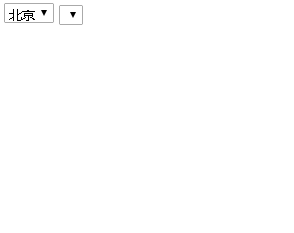

# 简单的二级菜单demotwolevelmenuDemo

效果如下：


fdfsdfd
demo code:
```
<!DOCTYPE html>
<html>
<head lang="en">
    <meta charset="UTF-8">
    <title></title>
</head>
<body>
<select id="shengshi" onchange="asd(this)">

</select>
<select id="qu">

</select>

</body>
</html>
<script>
    var arr=["北京","上海","深圳"];
    var quArr=[];
    quArr[0]=["丰台区","海淀区","朝阳区"];
    quArr[1]=["上海1","上海2","上海3"];
    quArr[2]=["深圳1","深圳2","深圳3"];

    function asd(t){
        qu.innerHTML="";
        var diquArr=quArr[t.selectedIndex];
        for(var i=0;i<diquArr.length;i++){
            qu.add(new Option(diquArr[i],i),null);
        }

    }
    window.onload=function(){
        for(var i=0;i<arr.length;i++){
            shengshi.add(new Option(arr[i],i),null);
        }

    }
</script>
```

